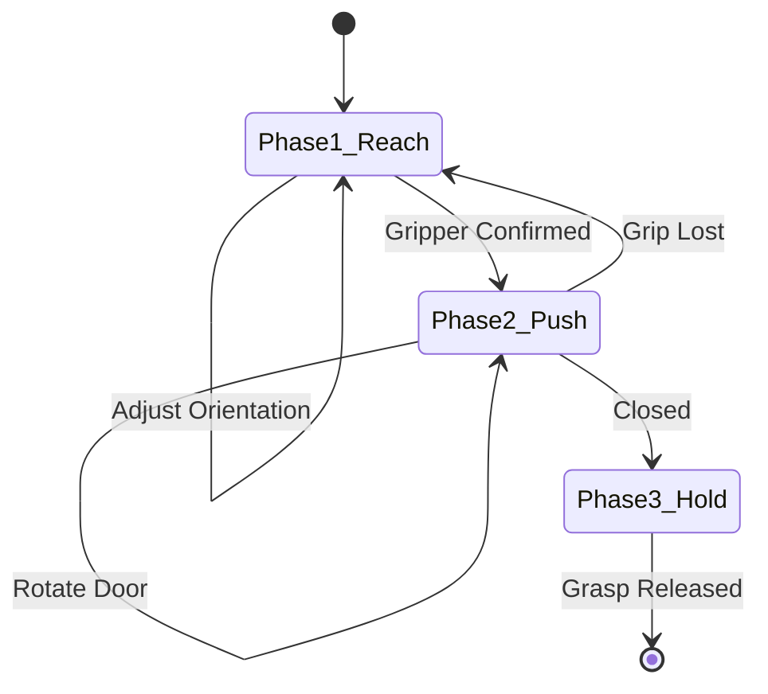
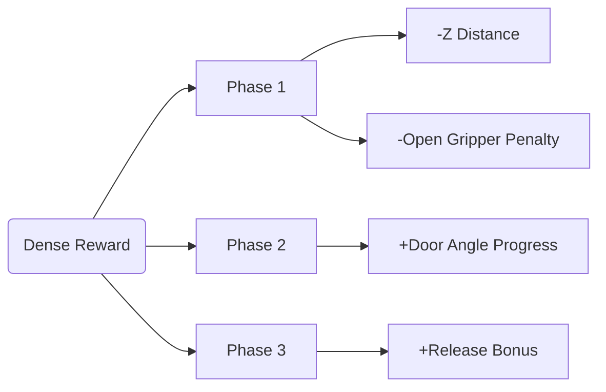
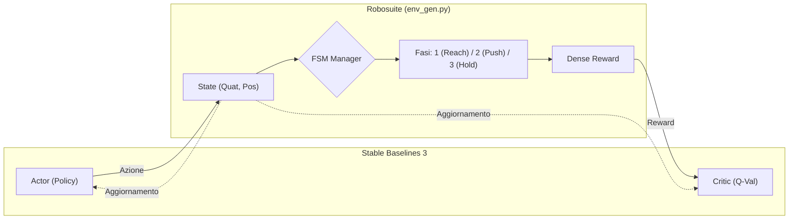
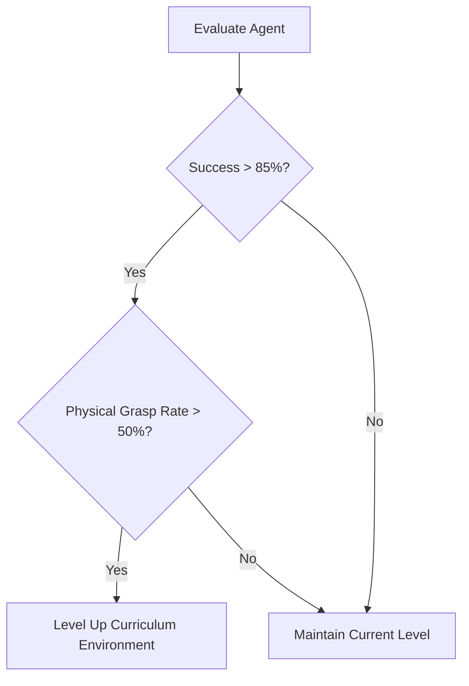

# Generalized Door Closing with Reinforcement Learning

## Stato dell'Arte e Struttura del Codice (Panoramica Implementazioni)

Questo documento traccia l'evoluzione e lo stato corrente del progetto, finalizzato all'addestramento di un braccio robotico Franka Emika Panda per il task generalizzato di chiusura di una porta. 

### Struttura della Codebase Attuale
L'architettura del codice ruota attorno all'integrazione tra il motore fisico **Robosuite** (basato su MuJoCo) e la libreria di Reinforcement Learning **Stable Baselines 3 (SB3)**. 

I file principali che compongono l'implementazione sono:
*   `close_generalized/env_gen.py`: Costituisce il **core fisico e logico** del progetto. Implementa il wrapper personalizzato per l'ambiente (`GeneralizedDoorEnv`). Qui risiede la **Macchina a Stati Finiti (FSM)** e la complessa logica di calcolo dinamico delle ricompense (Reward Shaping) in base alla fase corrente dell'agente (Reach, Push, Hold). Qui vengono processate anche le fisiche di contatto e generati i log di diagnostica custom come `[GRASP]`.
*   `train_close.py` e `close_generalized/train_gen.py`: Orchestrano il **training loop**. Il modulo `train_gen.py` gestisce l'inizializzazione del SAC e inietta *callback* custom (come la logica di *Curriculum Learning* e il tracking del *Grasp Rate* da esportare in TensorBoard).
*   `config/train_close_config.py`: Il file centrale di **configurazione iperparametrica**. Definisce e isola elementi vitali dell'addestramento e della rete come `gamma`, `tau`, l'architettura dei nodi `policy_net_arch` (attualmente MLP 256x256), la soglia di `learning_starts` e la frontiera orizzontale di fine test (`total_steps = 1.2M`).

### Stato Attuale dello Sviluppo 
Attualmente, l'agente sfrutta in via esclusiva l'algoritmo **Soft Actor-Critic (SAC)** lavorando su spazi di azioni continue (da -1.0 a 1.0) su 7 gradi di libertà (traslazione, rotazione, morsa).
Il robot ha completato la prima enorme macro-sfida: ha imparato ad avvicinarsi e chiudere la porta (Success Rate del 100%) scongiurando il "reward hacking" passivo (come prendere a spallate la porta).
Il progetto è entrato ora nella fase di **Refactoring di Efficienza ed Esattezza Biomeccanica**. Lo sforzo di codice si sta focalizzando su:
1. **Solidità della Presa**: Aggiornare `env_gen.py` per penalizzare lo "scivolamento" ed esigere una presa meccanicamente stretta a morsa sul maniglione, anziché sfruttare l'attrito superficiale dall'alto.
2. **Tempo di Calcolo**: Aggiornare l'ambiente per sganciare il braccio ("Retreat") ed emettere il segnale di `done` (troncare l'episodio) esattamente quando la porta è chiusa, abbattendo gli step orfani.

---

## Slide 1-2: Architectural Overview (FSM)

**A Need for Structure: The Finite State Machine (FSM)**



*Why FSM?* It allows phase-isolated reward functions, avoiding contradictory gradients (e.g., punishing movement after the door is closed).

---

## Slide 3: Reward Structuring

Una mappatura densa delle ricompense attenua la complessità dell'esplorazione spaziale.



**Cosa si evince da questo schema:**
Il diagramma mostra come il segnale di "premio" non sia assegnato solo ciecamente alla fine del task. `<br />`
Lo abbiamo decostruito ("Dense Reward") a cascata in tre sotto-valutazioni isolate in base alla Fase in cui il robot si trova:

* In **Fase 1**, il robot riceve micro-feedback continui per correggere la mira: è penalizzato se si avvicina con il gripper troppo aperto o se vola a un'altezza errata sull'asse Z.
* In **Fase 2**, il Reward cambia dinamicamente: diventa positivo e premia proporzionalmente la progressione in radianti dell'angolo della porta (l'azione di spingere).
* In **Fase 3**, si innesca il premio finale (__release bonus__) solo se il robot si allontana mantenendo la porta chiusa in sicurezza.

---

## Slide 4: Architettura completa (SAC)

L'agente non apprende alla cieca, ma interagisce con un ambiente strutturato (la FSM) che filtra il calcolo dei Reward guidando in maniera sana e stabile l'apprendimento.



### Come funziona il codice (Flusso di esecuzione nello schema)

L'ambiente `env_gen.py` estrae lo stato (quaternion, giunti, porta, gripper) ma per impedire che il robot ottenga premi barando, il flusso dati funziona così (seguendo le frecce):

1. **Andata (Azione)**: L'Actor in Stable Baselines 3 genera un comando continuo (che va da -1.0 a 1.0) per muovere braccio e gripper in base alla policy imparata.
2. **Ambiente (Robosuite)**: Questo comando muove il robot su schermo. Il sistema estrae i nuovi sensori fisici (OBS) e li invia in pasto al Manager della Macchina a Stati Finiti (FSM).
3. **Smistamento Logico (Fasi)**: La FSM analizza le variabili (il gripper è chiuso regolarmente? La porta si sta innescando in movimento?) e categorizza brutalmente l'azione verso le 3 Fasi separate.
4. **Ritorno (Reward e Aggiornamento)**: Dalle Fasi viene calcolato il __dense reward__. Questo punteggio netto, assieme al nuovo Stato (OBS), torna alla rete neurale che l'adopererà per aggiornare ed educare l'Actor a ripetere o evitare queste azioni in futuro.

---

## Slide 5: La Rete Neurale Sottostante e l'Architettura

Il modello core è supportato da **Soft Actor-Critic (SAC)**, perfetto per il mondo robotico perché gestisce spazi d'azioni continui calcolando sia il valore dell'azione che incoraggiando l'esplorazione (max-entropy).

* L'infrastruttura di base è definita dalla configurazione `policy_net_arch = (256, 256)`. Utilizza un *Multi-Layer Perceptron (MLP)* con due strati nascosti da 256 nodi.
* **Cosa si può modificare:**
  * **Layer NN**: Si possono aggiungere feature-extractor esterni o inspessire la rete (es `(512, 512)`) per renderla più attenta a dettagli matematici (es: quaternioni più precisi), a costo di aumentare i tempi.
  * **Learning Rate (`3e-4`)**: Scalare questo valore modificherà la velocità con cui l'Actor aggiusta le sue convizioni sui pesi.
  * **Entropia (`ent_coef = auto`)**: Gestisce lo stocastico. Abbassarla forza l'agente a comportarsi in modo de-randomizzato presto __ma rischia sub-ottimizzazioni__.

---

## Slide 6: Masterizzazione della Fase 1 (Reach & Grasp)

Superare i colli di bottiglia nell'esplorazione e i segnali mancanti.

* **The Z-Axis Deficit:** I primi modelli non riuscivano a sollevare il braccio abbastanza in alto. Il problema è stato risolto con una penalità verticale isolata.
* **Linear vs Exponential:** I gradienti di distanza sono stati appiattiti fino a raggiungere una pendenza lineare. Le curve esponenziali hanno fornito un segnale di apprendimento prossimo allo zero a grandi distanze.
* **Freeing the Agent:** Le penalità standard per le azioni causavano il "congelamento" dell'agente per minimizzare i punti negativi. L'eliminazione delle penalità per le azioni nella Fase 1 ha potenziato l'esplorazione.

---

## Slide 7: Sradicamento del "Reward Hacking"

Privilegiare la destrezza rispetto alla forza bruta.

* **The Pushing Problem:** Le ricompense standard dense assegnano punti se la porta si muove. Il robot ha imparato a sbattere il braccio contro la superficie.
* **Conditional Grasp Reward:** L'assegnazione dei punti per il progresso è ora esplicitamente vincolata al raggiungimento di determinati obiettivi. Il codice richiede che la pinza venga registrata come "chiusa" *prima* di assegnare punti per il movimento della porta.
* **Mechanical Validation:** La soglia di attivazione per una "presa" è stata aumentata da 0,4 a 0,6, garantendo un impegno meccanico profondo anziché un semplice tocco superficiale.

---

## Slide 8: Realismo Geometrico & Cosa è "Generalizzato"

Imporre vincoli biomeccanici paragonabili a quelli umani all'interno dello spazio di osservazione:

* **Z-Matrix Alignment:** L'end-effector deve essere matematicamente parallelo all'asse di rotazione della maniglia della porta.
* **Horizontal Clamping:** Penalizzare le deviazioni nella rotazione di rotolamento garantisce che la pinza rimanga piatta.
* **Approach Angles:** Una penalità di `-3.0` specifica scoraggia esplicitamente i movimenti di spazzamento "dal basso verso l'alto".

**La Generalizzazione (Perché il modello funziona a prescindere dal setup esatto)**:

1. Posizione della maniglia/porta e angolazione offset sono __random__ ad ogni episodio.
2. Dimensione e l'attrito della maniglia alterati __dinamicamente__.
3. Il robot deve usare percezione relativa e adattarsi anziché memorizzare le coordinate.

---

## Slide 9: Parametri di Configurazione (train_close_config.py) e Significato

* **`total_steps`**: `1.200.000` Timestep massimi di allenamento.
* **`gamma`**: `0.95`. Scontare rapidamente i reward futuri rende l'agente più "miope" ma è perfetto per spingerlo a concatenare le 3 fasi velocemente, imparando il nesso di causa-effetto Reach → Grasp → Close in meno cicli.
* **`horizon`**: `400`. Passi massimi prima che l'ambiente faccia reset.
* **`control_freq`**: `30`. L'Actor interroga l'ambiente 30 volte al secondo d'azione simulata.
* **`learning_starts`**: `5_000`. Step casuali accumulati nel replay buffer all'inizio, così la backpropagation parte con un dataset variegato senza overfitting locale. Si può aumentare.
* **`tau`**: `0.005`. (__Polyak Average__). Determinare quanto delicatamente il target Critic aggiorna i parametri per evitare oscillazioni nei Q-Value.

---

## Slide 10: Adaptive Curriculum Learning

Procedural generation scaling difficulty dynamically.



*Impact:* This dual-gate prevents the agent from generalizing a local optimum (punching) to harder geometries, keeping physics grounded.

---

## Slide 11: Analisi Risultati Sperimentali (TensorBoard Log 3M Steps)

Di seguito l'estratto dell'addestramento conclusivo:

```text
Eval num_timesteps=3000000, episode_reward=771.42 +/- 35.36
Episode length: 400.00 +/- 0.00
Success rate: 100.00%
| custom/ grasp_count: 95
| grasp_rate: 0.95
| train/ ent_coef: 1.7e-05
```

**Spiegazione, Dettagli e Motivazioni:**

1. **Performance Ottimali (`Success Rate 100%`)**: Il SAC ha pienamente risolto il task.
2. **Il `grasp_rate` al 0.95**: Questa metrica custom FSM dimostra esplicitamente che **95 volte su 100 il braccio stabilisce meccanicamente la presa ("PHYS_OK") sulla maniglia** anziché lanciare pugni alla porta o fare pushing barando.
3. **Convergenza Stabile (`ent_coef = 1.7e-05`)**: Durante l'esplorazione SAC cerca di restare incerto, ma ora il valore di entropia è diventato praticamente zero (`1.7e-05`), indicando che la rete "sa" con assoluta precisione matematica che c'è solo un set di traiettorie dominante per completare il task e lo esegue meccanicamente.
4. **Tempo e Cicli Sprecasti (`ep_len_mean = 400`)**: Spiega esattamente la sensazione che la scena duri "infinitamente". Il successo avviene prima, ma dato che il robot ottiene ancora micro-premi posizionali senza un trigger esplicito di conclusione, l'episodio scivola sprecando centinaia di step a vuoto e allungando drammaticamente i tempi complessivi di esecuzione.

**Analisi Diagnostica - Studio del Log di Presa `[GRASP]`**:

```text
[GRASP] dist=0.121  dXY=0.006  dZ=-0.121  grip=-0.07 (PHYS_OK)  confirm=5/5
[GRASP] dist=0.110  dXY=0.016  dZ=-0.109  grip=-0.08 (PHYS_OK)  confirm=5/5
[GRASP] dist=0.112  dXY=0.022  dZ=-0.109  grip=+0.09 (PHYS_OK)  confirm=5/5
[GRASP] dist=0.073  dXY=0.026  dZ=-0.069  grip=+0.13 (PHYS_OK)  confirm=5/5
[GRASP] dist=0.123  dXY=0.019  dZ=-0.122  grip=-0.13 (PHYS_OK)  confirm=5/5
```

Ecco come si decifra tecnicamente questo log diagnostico emesso dalla stabilità della FSM:

* **Allineamento Orizzontale Esatto (`dXY` è minuscolo)**: Valori come `0.006` a `0.026` dimostrano che il robot sta posizionando il centro del gripper con precisione millimetrica proprio sopra il target sul piano 2D. Non "manca" la maniglia da destra o sinistra.

* **Problema sull'Avvallamento d'Altezza (`dZ` negativo e massivo)**: Si nota che la distanza totale (`dist`) è identica in entità logica a `dZ` (es. `dist=0.121`, `dZ=-0.121`). Questo significa che quasi tutto il gap intercorso tra il robot e il centro esatto della maniglia è distribuito unicamente sull'asse verticale Z. E' in "affossamento relativo": il robot sta agganciando la maniglia da una posizione superiore limitando la sua estensione. Segnala uno *scivolamento latente in presa*.

* **Comando Attuatore Prensile (`grip`) e Valutazione `(PHYS_OK)`**: I valori del comando `gripper_action` (emessi dalla rete neurale) scorrono tra il leggermente aperto o allentato (`-0.13`) al lievemente chiuso (`+0.13`). Non applica il blocco e la contrazione totale di blando clamp `+1.0`. Apparentemente l'intenzione della rete di stringere è volutamente debole e marginale. Tuttavia, la validazione `(PHYS_OK)` si accende solo se il motore fisico (MuJoCo) certifica che il gripper sta subendo una forza normale opposta, e dunque un contatto stringente vero con la massa.

* **Tenuta Stagna Garantita (`confirm=5/5`)**: Il robot sblocca la transizione alla FASE 2 solo perché mantiene saldo questo contatto per ben 5 frame consecutivi indivisibili. Cos'ha imparato la rete? L'agente sfrutta un trucchetto puramente fisico: anziché clampare brutalmente a `1.0` incastrandosi rigidamente, preferisce calarsi dall'alto ("dZ") innescando pretestuosamente il minimo l'attrito sufficiente `(PHYS_OK)` per ingannare la FSM, triggerando la fase successiva col minor costo di spostamento possibile ma rimanendo incline allo scivolamento in FASE 2.

---


## Slide 12: Obs della Rete Neurale sottostante

Attualmente, la configurazione della rete viene passata alla classe `SAC` all'interno dei file di addestramento tramite il parametro `policy_kwargs`.

```python
model = SAC(
    "MlpPolicy",
    env,
    # ... altri iperparametri ...
    policy_kwargs=dict(net_arch=list(cfg.policy_net_arch)),
)
```

Puoi usare questa flessibilità a tuo vantaggio per:

- **Cambiare le dimensioni dei layer**: Modificando `cfg.policy_net_arch`.
- **Cambiare le funzioni di attivazione**: Aggiungendo `activation_fn=th.nn.ReLU` o altre funzioni di PyTorch.
- **Aggiungere feature extractor custom**: Puoi definire una rete in PyTorch che pre-processa le osservazioni prima di inviarle ai layer MLP.

### Risultato dell'Analisi

```text
--- RAW OBSERVATIONS DA ROBOSUITE ---
robot0_joint_pos: (7,) (ndim: 1)
robot0_joint_pos_cos: (7,) (ndim: 1)
robot0_joint_pos_sin: (7,) (ndim: 1)
robot0_joint_vel: (7,) (ndim: 1)
robot0_eef_pos: (3,) (ndim: 1)
robot0_eef_quat: (4,) (ndim: 1)
robot0_eef_quat_site: (4,) (ndim: 1)
robot0_gripper_qpos: (2,) (ndim: 1)
robot0_gripper_qvel: (2,) (ndim: 1)
door_pos: (3,) (ndim: 1)
handle_pos: (3,) (ndim: 1)
hinge_qpos: () (ndim: 0)
door_to_eef_pos: (3,) (ndim: 1)
handle_to_eef_pos: (3,) (ndim: 1)
handle_qpos: () (ndim: 0)
robot0_proprio-state: (43,) (ndim: 1)
object-state: (14,) (ndim: 1)

--- OSSERVAZIONI FLATTENED PER LA RETE NEURALE ---
Keys usate: ['door_pos', 'door_to_eef_pos', 'handle_pos', 'handle_to_eef_pos', 'object-state', 'robot0_eef_pos', 'robot0_eef_quat', 'robot0_eef_quat_site', 'robot0_gripper_qpos', 'robot0_gripper_qvel', 'robot0_joint_pos', 'robot0_joint_pos_cos', 'robot0_joint_pos_sin', 'robot0_joint_vel', 'robot0_proprio-state']
Totale input alla Rete Neurale: 112 neuroni

--- OUTPUT DELLA RETE (ACTION SPACE) ---
Box(-1.0, 1.0, (7,), float32)
```

La rete neurale ha un **livello di input di 112 neuroni**. Questi 112 valori sono generati prendendo il dizionario grezzo di RoboSuite, filtrandolo per mantenere **solo gli array 1-dimensionali (`ndim == 1`)**, ordinandoli in ordine alfabetico e concatenandoli in un unico vettore.

Le osservazioni incluse sono:
- **Cinematica del Robot**: Posizioni (`robot0_joint_pos`), seni e coseni (`_cos`, `_sin`), e velocità dei 7 giunti (`robot0_joint_vel`).
- **End-Effector (EEF)**: Posizione 3D (`robot0_eef_pos`) e orientamento in quaternioni (`robot0_eef_quat`, `robot0_eef_quat_site`).
- **Gripper**: Apertura delle dita (`robot0_gripper_qpos`) e velocità delle dita (`robot0_gripper_qvel`).
- **Oggetti e Task**: 
  - Posizione assoluta della porta (`door_pos`) e della maniglia (`handle_pos`).
  - Vettori relativi (differenze di coordinate 3D): dall'EEF alla porta (`door_to_eef_pos`) e dall'EEF alla maniglia (`handle_to_eef_pos`).
- **Stati Aggregati**: Array riassuntivi generati da RoboSuite per la propriocezione (`robot0_proprio-state`, 43 valori) e per lo stato dell'oggetto (`object-state`, 14 valori).

### Output
Il livello di output ha **7 neuroni**, ognuno con un valore continuo costretto tra **-1.0 e 1.0**.
Sebbene dipenda dal controller specifico utilizzato ("OSC_POSE" di default in robosuite per questo tipo di task), in genere rappresentano:
- **[0, 1, 2]**: Traslazione del centro dell'end-effector (x, y, z).
- **[3, 4, 5]**: Rotazione dell'end-effector (roll, pitch, yaw).
- **[6]**: Comando di chiusura/apertura del gripper (valori negativi = apri, positivi = chiudi).

### 🔴 Rilevazioni
A causa della riga di codice in `train_close.py` `if isinstance(v, np.ndarray) and v.ndim == 1`, gli scalari restituiti da RoboSuite come array a 0-dimensioni (`ndim == 0`) **vengono scartati**.
- **`hinge_qpos`** (l'angolo reale della cerniera della porta)
- **`handle_qpos`** (l'angolo di pressione della maniglia)
Attualmente la rete non vede questi due valori in modo esplicito (potrebbero essere nascosti nell'`object-state`, ma è preferibile esporli).

1. **Distanza esplicita (Scalare) Gripper-Maniglia**: Il calcolo matematico `np.linalg.norm(handle_pos - eef_pos)` è usato *solo* per calcolare la ricompensa (nei file `env_gen.py`), ma la rete neurale deve arrangiarsi a dedurre questa distanza dai vettori cartesiani `handle_to_eef_pos`. Fornire lo scalare nudo aiuta la rete.
2. **Dimensioni Fisiche della Maniglia**: Come avevi intuito, **mancano**. Nel curriculum (`env_gen.py`), il raggio e la lunghezza della maniglia vengono randomizzati (`_current_handle_radius`), ma **non vengono comunicati alla rete**. La rete sta cercando di afferrare un oggetto di cui ignora lo spessore.
3. **Errore e stato delle fasi (FSM)**: Il progetto usa una macchina a stati per le fasi 1, 2 e 3 della chiusura, ma la rete non sa in quale "fase" l'ambiente la consideri.

---

## Slide 13: Obiettivi Futuri e Problemi da Risolvere sulla Base del Codice Attuale

Il codebase ha raggiunto una base geniale, ma si rivelano necessarie indagini biomeccaniche e raffinamenti di efficienza:

### 1. Impugnatura più salda e Analisi Scivolamento

* **Per Risolvere**: Lavorare a quanto descritto in precedenza nella slide 11 riguardo al problema sull'avvallamento d'altezza e il comando attuatore prensile.
 
### 2. Delay di 2 Secondi, Rilascio e Ritorno in Posizione Originale (Retreat/Home)

* **Status Attuale FSM**: La FASE 3 fa l'Hold ma non conclude correttamente il task col ritorno.
* **Correzione (Phase 3 & Config)**: In FASE 3 vincolare lo switch di reward solo al completamento di 2 cicli (60 step al count), forzando poi il distacco (`gripper_action < _GRIPPER_OPEN_THRESH`). Occorre parallelamente attivare `enable_return_stage = True` nel file config in modo che il robot sia trainato dal *retreat_reward* per tornare indietro verso `self._retreat_pos`.

### 3. Abbattimento dei Tempi di Esecuzione Interminabili

* **Per Risolvere**: Lavorare a quanto descritto in precedenza nella slide 11 riguardo al problema di tempo e cicli sprecati.

### 4. Integrazione di Logging Esaustivo e Dettagliato

* Raccogliere dati in Tensorboard o debug via stdout è essenziale per diagnosticare colli di bottiglia o FSM loop. <br />
* Aggiungiamo più sensori virtuali (ad es. per mostrare escursione maniglia, deviazione z-matrix o attrito scivolante calcolato) così capiamo esplicitamente perché il robot agisca con quel comportamento pseudo-random in hold.

### 5. Idee per proseguire
Fondamentale (e possibile punto di svolta) è il paper __DisCor__, quindi sicuro è da leggere e studiare, per prima cosa.
--> Monitorare il parametro 'learning_starts'
--> Bisogna provare ad inspessire la rete neurale sottostante.
--> Per il momento conviene concentrarsi sull'impugnatura, nel solidificarla come si deve.
    1. Deve essere più salda e non deve scivolare.
    2. Probabilmente servono più dettagli sulla maniglia (spessore, dimensioni, ecc.) di robosuite.
    3. Lui impugna dall'alto, bisognerebbe vedere il gripper di quanto si può allargare.

Nota molto importante: per il momento l'apprendimento non si basa sul modello migliore appreso in precedenza (da processi di learning diversi). Anche questa può essere una buona cosa da implementare.

---

## Slide 14: Letteratura

1. I Paper Fondamentali (Le Basi) Questi articoli spiegano come SAC utilizzi l'Entropia per favorire l'esplorazione:

    __Soft Actor-Critic: Off-Policy Maximum Entropy Deep Reinforcement Learning with a Stochastic Actor (Haarnoja et al., 2018)__.
    __Soft Actor-Critic Algorithms and Applications (Haarnoja et al., 2018)__.

2. Articoli sui Limiti e Criticità (dove SAC fallisce o dove può essere ottimizzato):

    __Controlling Overestimation Bias with Truncated Q-Learning (Fujimoto et al., 2018 - Paper su TD3, ma essenziale per SAC)__.
    __Is High-Frequency Off-Policy Learning Possible? (Smith et al., 2022)__.
    __Sample-Efficient Reinforcement Learning via Conservative Q-Learning (CQL) (Kumar et al., 2020)__.

3. Eventuali soluzioni ai limiti (come la letteratura ha cercato di superare SAC):

    __DisCor: Corrective Feedback in Reinforcement Learning via Distribution Correction (Kumar et al., 2020)__.
    __Soft Actor-Critic with Diversified Experience Replay (Hou et al., 2020)__.
        * Affronta il problema della gestione del Replay Buffer in SAC, che spesso ignora transizioni rare ma fondamentali.


| Limite                        | Descrizione                                                           | Paper di Riferimento        |
| :---------------------------- | :-------------------------------------------------------------------- | :-------------------------- |
| **Overestimation Bias**       | Tendenza a sovrastimare il valore delle azioni.                       | Fujimoto et al. (TD3 paper) |
| **Offline Performance**       | Pessime performance se non può interagire costantemente.              | CQL (Kumar et al.)          |
| **Sensibilità Iperparametri** | Nonostante l'entropia automatica, rimane sensibile al reward scaling. | Haarnoja et al. (2018b)     |
| **Brittleness in High-Dim**   | Difficoltà in spazi d'azione ad altissima dimensionalità.             | Vari                        |