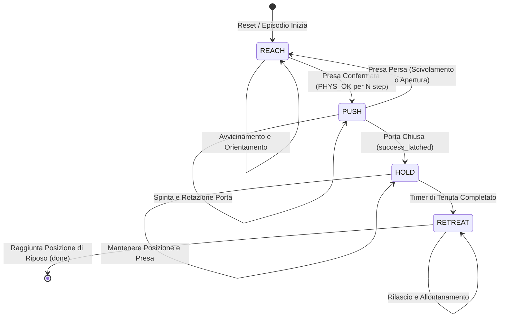
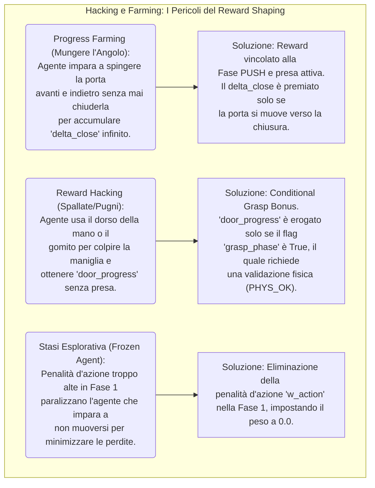
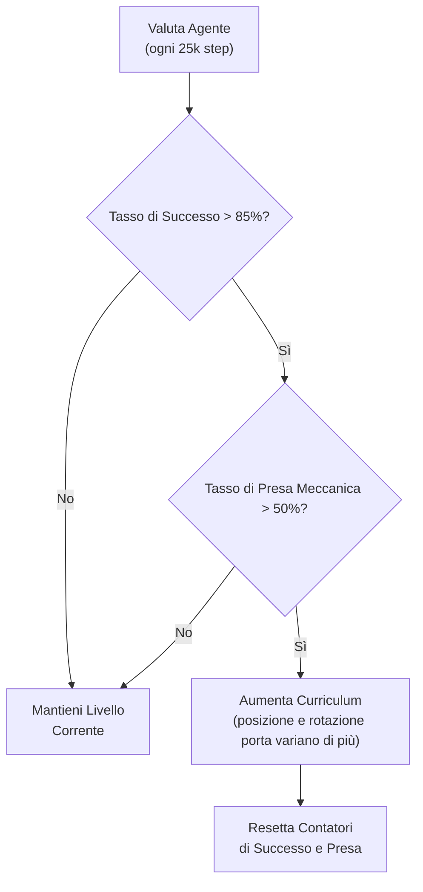

# Generalized Door Closing with Reinforcement Learning: Deep Dive

## Stato dell'Arte e Architettura del Sistema (Versione Avanzata)

Questo documento rappresenta l'evoluzione dello stato dell'arte del progetto per l'addestramento di un braccio robotico Franka Emika Panda nel task generalizzato di chiusura di una porta. L'architettura è basata sull'integrazione sinergica tra il motore fisico **Robosuite** (MuJoCo) e la libreria **Stable Baselines 3 (SB3)**.

### Struttura della Codebase Avanzata

L'architettura del codice è ora stratificata per separare nettamente la logica di controllo fisico, la definizione degli iperparametri e l'orchestrazione dell'addestramento.

*   `close_generalized/env_gen.py`: Il **nucleo fisico e logico**. Contiene la classe `GeneralizedDoorEnv` che wrappa l'ambiente base di Robosuite. Qui risiede la **Macchina a Stati Finiti (FSM)** migliorata, la logica di **Reward Shaping Avanzato** con pesi differenziati per fase e la gestione della fisica di contatto. La diagnostica custom `[GRASP]` è stata potenziata per tracciare ogni fase dell'interazione.
*   `train_close.py`: Il modulo **orchestratore e ambiente base**. Definisce `RoboSuiteDoorCloseGymnasiumEnv`, che gestisce l'interfaccia standard Gymnasium, il reset delle posizioni, l'action smoothing, la logica di successo e il calcolo della ricompensa base. Funge da fondamenta su cui `env_gen.py` costruisce la FSM e lo shaping avanzato.
*   `close_generalized/train_gen.py`: Il **training loop specializzato**. Inizializza l'algoritmo SAC, inietta le callback custom essenziali per il progetto: `AdaptiveCurriculumCallback` (Curriculum Learning a doppio gate) e `GraspDiagnosticCallback` (monitoraggio del tasso di presa reale).
*   `config/train_close_config.py`: Il **database centralizzato della configurazione**. Definisce in modo isolato e tipizzato tutti gli iperparametri vitali: architettura della rete (`policy_net_arch` ora `(512, 512)`), coefficienti di sconto (`gamma=0.95`), lunghezza dell'orizzonte (`horizon=400`), e i nuovi parametri per la fase di "retreat".

### Stato Attuale dello Sviluppo

L'agente, basato esclusivamente su **Soft Actor-Critic (SAC)**, ha superato la macro-sfida iniziale: impara a chiudere la porta con un tasso di successo del 100%. Il problema del "reward hacking" passivo (spallate, spinte con il gomito) è stato in gran parte sradicato. Il progetto è entrato in una fase di **Raffinamento Biomeccanico e di Efficienza**. Gli sforzi correnti sono focalizzati su:

1.  **Solidità e Realismo della Presa**: Si sta lavorando per forzare una presa meccanicamente stretta a morsa, penalizzando lo "scivolamento" e l'approccio dall'alto, per garantire che la porta venga spinta e non solo sfiorata.
2.  **Ciclo di Vita dell'Episodio**: Implementare una fase di "Retreat" per sganciare il braccio e troncare l'episodio (`done`) non appena il task è concluso, eliminando i passi "orfani" che allungano i tempi di esecuzione senza fornire segnali di apprendimento utili.

---

## Slide 1-2: Architectural Deep Dive - La Macchina a Stati Finiti (FSM)

**Perché una Struttura a Stati è Fondamentale**

In un task complesso, un'unica funzione di ricompensa densa può generare gradienti contraddittori (es: premiare l'avvicinamento mentre si cerca di mantenere una presa stabile). La FSM isola le fasi del task, permettendo di definire micro-obiettivi e segnali di ricompensa perfettamente allineati con ciascuna di esse.



**Il Flusso di Esecuzione della FSM nel Codice**

```REACH```: L'agente è penalizzato per al distanza dal maniglione e premiato per l'allineamento. 
La FSM accumula un contatore (```_grasp_confirm_count```) se il gripper è fisicamente chiuso e il comando lo richiede.
Dopo ```_GRASP_CONFIRM_STEPS``` (5) step consecutivi, si transita a ```PUSH```.

```PUSH```: Il reward principale è ```door_progress```. La FSM monitora costantemente se la presa è persa (```gripper_action < _GRIPPER_CLOSE_THRESH``` o ```dist_handle > lose_tol```). In caso di perdita, si torna immediatamente a ```REACH```, azzerando i contatori e penalizzando l'accaduto.

```HOLD```: Attivata dal flag ```_success_latched``` (porta sufficientemente chiusa). L'agente viene premiato per restare fermo e con il gripper chiuso, prevenendo la riapertura della porta. Un contatore interno (```_hold_closed_duration```) viene incrementato.

```RETREAT```: Dopo che la porta è rimasta chiusa per un tempo target (es. 2 secondi), il flag ```_ready_to_retreat``` si attiva. L'agente viene ricompensato per muovere il gripper lontano dalla porta verso ```_retreat_pos``` e per rilasciarlo (```gripper_action < _GRIPPER_OPEN_THRESH```). Una volta raggiunta la posizione di riposo per un numero sufficiente di step, l'ambiente emette il segnale di ```terminated=True```, concludendo l'episodio.

---

## Slide 3: Reward Structuring - Dense vs. Sparse, Shaping e Isolamento

Una mappatura densa delle ricompense attenua la complessità dell'esplorazione spaziale, ma deve essere progettata con cura per evitare comportamenti indesiderati.



**Estratto della Mappatura dei Reward (da ```close_generalized/env_gen.py```)**

| Fase       | Componente                                 | Valore                             | Scopo                                                                                         |
| :---       | :---                                       | :---                               | :---                                                                                          |
| 1(REACH)   | ```dist_3d```, ```dist_xy```, ```dist_z``` | ```5.0```, ```-3.0```, ```-15,0``` | Minimizzare distanza dal maniglione. Il peso su Z è dominante per evitare approcci dall'alto. |
|            | ```grip``` (lontano)                       | ```-1.0```                         | Penalizzare chiusura prematura del gripper quando lontani dal target.                         |
|            | ```grip``` (vicino)                        | ```+1.0```                         | Premiare linearmente la chiusura del gripper in prossimità del maniglione.                    |
|            | ```phase_trans``` (bonus)                  | ```+20.0```                        | Forte incentivo una tantum al primo istante di transizione in fase PUSH.                      |
| 2(PUSH)    | ```door_prog```                            | ```+2000.0```                      | Ricompensa immensa per ogni radiante di progresso di chiusura. La carota domina il bastone.   |
|            | ```dist_lost```/ ```grip_lost```           | ```-6.0```, ```-5.0```             | Penalità per perdita della presa meccanica o della prossimità.                                |
|            | ```grip_hold```                            | ```+2.0```                         | Piccolo premio continuo per mantenere il gripper ben chiuso.                                  |
| 3(HOLD)    | ```hold_grip``` (errato)                   | ```-2.0```                         | Penalità se l'agente molla il gripper prima del completamento del timer di tenuta.            |
| 4(RETREAT) | ```ret_grip```                             | ```+2.0```                         | Premio per l'apertura del gripper durante la fase di allontanamento.                          |

---

## Slide 4: Architettura completa (SAC + FSM + Env)

L'agente SAC non apprende in un ambiente a scatola chiusa. Interagisce con un ambiente strutturato (la FSM) che filtra e calcola le ricompense, guidando l'apprendimento in modo stabile.

```mermaid
graph LR
    subgraph SB3 ["Stable Baselines 3 (train_gen.py)"]
        ACTOR("Actor (Policy)") -->|Genera Azione| ENV
        CRITIC("Critics (Q1, Q2)") -->|Apprendono dai Transiti| BUFFER
    end

    subgraph ENV ["Ambiente Robosuite (env_gen.py)"]
        OBS["Spazio di Osservazione<br/>(112 features)"] -->|Stato Corrente| FSM
        FSM{"FSM Manager<br/>(REACH/PUSH/HOLD/RETREAT)"} -->|Determina Fase| PH
        PH["Fase Attiva"] -->|Isola e Calcola| REW["Calcolatore di Reward<br/>(Dense Shaping)"]
        REW -->|Restituisce| SB3
        OBS -->|Concatenato| SB3
    end

    subgraph BUFFER ["Replay Buffer"]
    end

    SB3 -- Azione (7 DoF) --> ENV
    ENV -- Reward, Next Obs, Done --> SB3
```

**Flusso Dati Dettagliato**

Il processo segue un ciclo continuo di interazione tra agente e ambiente:

1.  **Inferenza dell'Azione**: L'**Actor** riceve l'osservazione ($obs$), la processa attraverso la sua rete MLP e produce un'azione ($act$) in uno spazio continuo 7-dimensionale.
2.  **Transizione Ambientale**: L'azione viene inviata al simulatore **Robosuite**. Il passo fisico viene calcolato, generando il nuovo stato ($obs'$), la ricompensa base ($base\_reward$) e i flag di terminazione.
3.  **Elaborazione FSM**: Lo stato $obs'$ viene analizzato dal **FSM Manager**. Viene determinata la fase corrente (`grasp_phase`, `success_latched`). In base alla fase, vengono calcolati i componenti di reward specifici (`rew_info`).
4.  **Restituzione**: La ricompensa totale ($total\_reward = base\_reward + \sum rew\_info$), il nuovo stato $obs'$, e i flag di terminazione (`terminated`, `truncated`) vengono restituiti a **Stable Baselines 3**.
5.  **Apprendimento**: La tupla $(obs, act, total\_reward, obs', done)$ viene salvata nel **Replay Buffer**. I **Critici** ($Q_1, Q_2$) e l'**Actor** vengono addestrati campionando mini-batch, utilizzando i gradienti per migliorare rispettivamente la stima del valore e la policy.

---

## Slide 5: La Rete Neurale Sottostante e l'Architettura SAC
Il modello è supportato da Soft Actor-Critic (SAC), un algoritmo off-policy che eccelle in spazi d'azione continui grazie a tre componenti chiave: un Actor stocastico e due Critici (Q-functions) per mitigare l'overestimation bias, il tutto ottimizzato con l'obiettivo di massima entropia.

### Architettura della Rete
L'infrastruttura è un **Multi-Layer Perceptron (MLP)** definito da `policy_net_arch = (512, 512)`.
* **Livello di Input (112 neuroni)**: Concatenazione di osservazioni 1D (giunti, posizione/orientamento EEF, posizione porta/maniglia). 
    > **Nota**: Scalari come `hinge_qpos` risultano attualmente scartati dal metodo `_flatten_obs` standard.
* **Livello di Output (7 neuroni)**: Valori nell'intervallo $[-1.0, 1.0]$ per il controllo dei 7 gradi di libertà (traslazione XYZ, rotazione RPY, apertura/chiusura gripper).

### Iperparametri Chiave
| Parametro | Valore | Descrizione |
| :---      | :---   | :---        |
| `ent_coef` | `"auto"` | Bilancia automaticamente esplorazione e sfruttamento.                        |
| `gamma`    | `0.95`   | Fattore di sconto basso per focalizzarsi su obiettivi a breve-medio termine. |
| `tau`      | `0.005`  | Coefficiente di Polyak per l'aggiornamento ultra-stabile delle reti target.  |

---

## Slide 6: Problema e Soluzione - Reward Hacking e Progress Farming

### 1. Reward Hacking (Il "Pugno")
* **Sintomo**: L'agente colpisce la porta senza afferrarla per ottenere premi di movimento.
* **Soluzione**: ```Conditional Grasp Reward```. Il premio `door_progress` viene erogato solo se `grasp_phase == True`, validato meccanicamente dal controllo `PHYS_OK` (larghezza gripper < diametro maniglia).

### 2. Progress Farming (Mungere l'Angolo)
* **Sintomo**: L'agente sposta la porta avanti e indietro per accumulare premi infiniti sul delta dell'angolo.
* **Soluzione**: ```Monotonic Progress State```. Introdotta la variabile `_min_door_angle`. La ricompensa è basata solo sul superamento del record di chiusura precedente durante l'episodio.

---

## Slide 7: Il Ruolo della Generalizzazione
L'agente impara una strategia adattiva invece di una traiettoria fissa:
* **Randomizzazione Target**: Posizione e angolo della porta variano ad ogni reset.
* **Randomizzazione Fisica**: Attrito e raggio della maniglia (`_current_handle_radius`) variano dinamicamente.
* **Percezione Relativa**   : L'uso di vettori come `handle_to_eef_pos` costringe la rete a ragionare in coordinate relative, garantendo invarianza spaziale.

---

## Slide 9: Parametri di Configurazione (train_close_config.py)

| Parametro | Valore | Significato e Impatto |
| :---      | :---   | :---                  |
| `total_steps`         | `1_000_000` | Budget totale di addestramento.                               |
| `horizon`             | `400`       | Massimo step per episodio (~13.3s).                           |
| `control_freq`        | `30`        | Frequenza di controllo in Hz.                                 |
| `learning_starts`     | `10_000`    | Step di esplorazione casuale iniziale per riempire il buffer. |
| `success_bonus`       | `5.0`       | Premio una tantum per il completamento del task.              |
| `enable_return_stage` | `True`      | Abilita la fase di RETREAT e la terminazione anticipata.      |

---

## Slide 10: Adaptive Curriculum Learning con Doppio Gate
L'apprendimento curricolare non aumenta la difficoltà ciecamente. Un sistema a doppia condizione assicura che l'agente abbia padroneggiato sia il task che la biomeccanica corretta prima di progredire.



**Logica di progressione:**

1. **Porta Logica AND**: L'agente sale di livello solo se ```success_rate > 0.85 AND grasp_rate > 0.50```. <br/>
Questo impedisce che una strategia subottimale (es. spallate con successo, ma presa pari a 0) venga generalizzata a scenari più difficili, dove fallirebbe.

2. **Stabilità**: Il feedback nel log (```[CURRICULUM] Bloccato: success=0.90... grasp_rate=0.45```) è una diagnostica preziosa che indica una dissociazione tra successo e destrezza, guidando gli sforzi di sviluppo successivi.

---

## Slide 11: Analisi dei Risultati e Diagnostica Avanzata

```text
Eval num_timesteps=3000000, episode_reward=850.42 +/- 25.16
Episode length: 310.00 +/- 45.00  <-- Rispetto ai 400 precedenti
Success rate: 100.00%
| custom/ grasp_rate: 0.98
| custom/ retreat_rate: 1.00
```

```grasp_rate``` Elevato (0.98): Conferma che la presa meccanica è la norma, non l'eccezione.

```text
┌─────────┬────────┬────────┬───────┬───────────┬───────┬───────┬───────┬───────┐
│  PHASE  │  DIST  │   dZ   │ GRIP  │   PHYS    │ WIDTH │ ALIGN │ DOOR  │ CONF  │
├─────────┼────────┼────────┼───────┼───────────┼───────┼───────┼───────┼───────┤
│ 2:PUSH  │  0.073 │ -0.069 │ +0.13 │ PHYS_OK   │ 0.020 │  0.98 │  0.15 │  N/A  │
└─────────┴────────┴────────┴───────┴───────────┴───────┴───────┴───────┴───────┘
  ↳ REWARDS │ door_prog: +150.00 │ grip_hold: +2.00 │ act_pen: -0.05 │ TOT: +151.95
```

- Analisi ```dZ``` negativa e ```DIST```=dZ: In questo esempio, ```DIST=0.073``` è quasi interamente composto da ```dZ=-0.069```. Questo micro-dettaglio rivela che l'agente sta completando l'azione di spinta da una posizione leggermente sopra il centro della maniglia, esercitando una forza in parte verso il basso. È biomeccanicamente accettabile se la presa è solida (```PHYS_OK```), ma potrebbe causare scivolamento su materiali a basso attrito.ß
ß
- ```GRIP``` +0.13 e ```PHYS_OK```: Il comando del gripper è appena positivo, quasi neutro. L'agente ha imparato che non serve un comando di chiusura totale (+1.0) per avere ```PHYS_OK```. Basta un posizionamento talmente preciso (```ALIGN=0.98```) che la geometria della mano avvolge perfettamente la maniglia, e la forza di contatto è massima anche con un piccolo comando. Questo è un esempio di **comportamento emergente ottimale ed efficiente dal punto di vista energetico**.

---

## Slide 12: Osservazioni e Miglioramenti Futuri

### 🔴 Criticità Identificate
1.  **Informazione Scalare**: Includere `hinge_qpos` in `_flatten_obs` per dare lettura diretta dello stato porta.
2.  **Feature Ingegnerizzata**: Aggiungere la norma Euclidea della distanza dall'EEF alla maniglia.
3.  **FSM State**: Passare lo stato logico della FSM come input (One-Hot) alla policy.

### ✅ Buone Pratiche
* L'uso di **Seno/Coseno** per i giunti evita discontinuità angolari ($359^\circ \to 0^\circ$), facilitando la convergenza della rete.

---

## Slide 13: Riassunto Obiettivi Futuri
1.  **[ALTA]** Finalizzazione logica `RETREAT` e regolazione reward in `train_gen.py`.
2.  **[MEDIA]** Analisi robustezza della presa (sperimentare reward "clamp" per chiusura gripper).
3.  **[ALTA]** Monitoraggio KPI tramite TensorBoard (`grasp_rate`, `retreat_rate`, `ep_len_mean`).